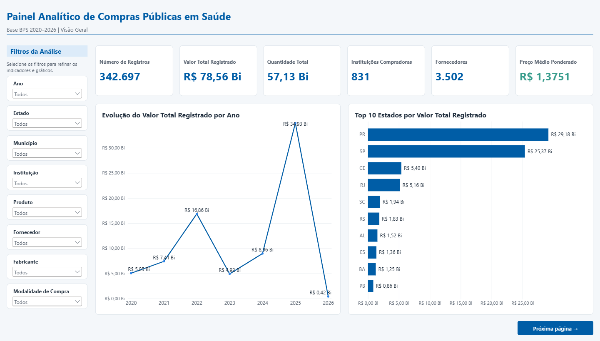
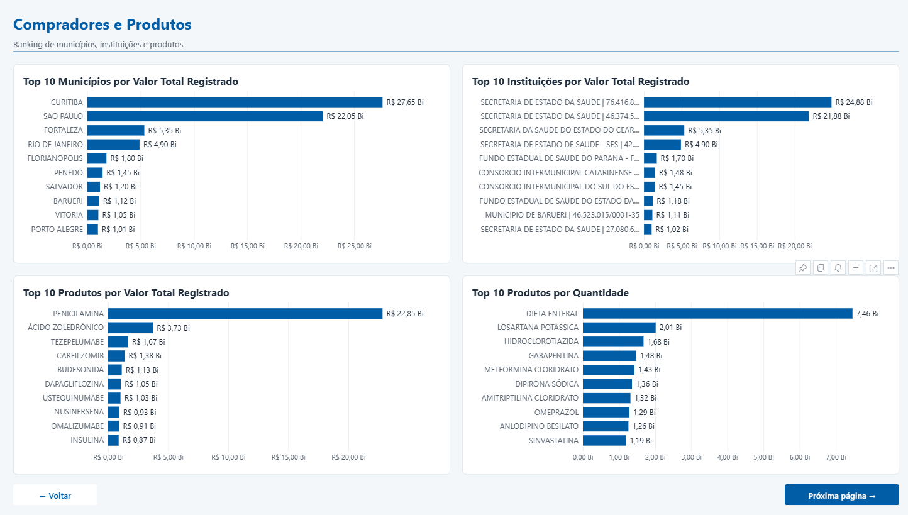
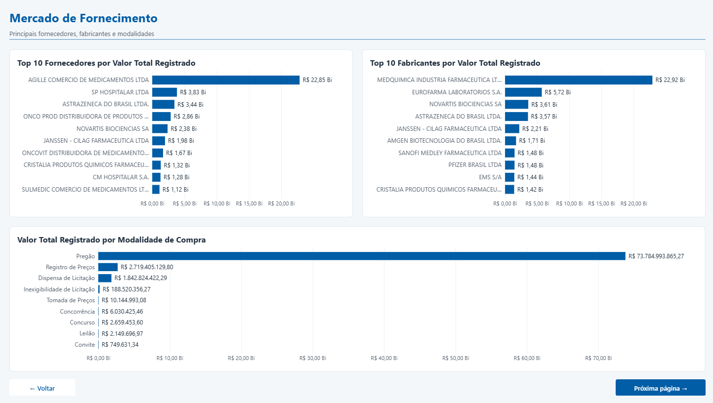

# Mini Projeto - Visualização de Dados e Business Intelligence

## Curso: SENAI/SC - Lab 365 | Módulo 2 - Semana 06

## Aluno: Petras Ruben Carvalho

## Projeto: Análise do Banco de Preços em Saúde - BPS (2020 a 2026)

Este repositório contém o desenvolvimento completo do processo de aquisição, preparação, tratamento, consolidação, análise e visualização dos dados do **Banco de Preços em Saúde - BPS**, disponibilizado pelo Ministério da Saúde.

O objetivo principal do projeto é transformar registros públicos de compras de medicamentos, materiais e dispositivos médicos em informações analíticas que permitam compreender valores registrados, quantidades adquiridas, instituições compradoras, fornecedores, fabricantes, modalidades de compra e diferenças de preços praticados no período de **2020 a 2026**.

O projeto foi desenvolvido utilizando **Python e Pandas para preparação, validação e consolidação dos dados** e **Microsoft Power BI para modelagem das métricas e construção do dashboard analítico**.

---

## 📊 Ferramentas e Tecnologias Utilizadas

- **VS Code** - Ambiente de desenvolvimento utilizado para criação e manutenção do projeto.
- **Python 3** - Linguagem utilizada para leitura, tratamento, validação e consolidação das bases.
- **Pandas** - Biblioteca utilizada para manipulação, preparação e análise dos DataFrames.
- **Microsoft Power BI** - Ferramenta utilizada para criação das métricas, análises e dashboard interativo.
- **DAX** - Linguagem utilizada para construção das medidas analíticas no Power BI.
- **Git** - Controle de versão e registro das principais etapas de desenvolvimento.
- **GitHub** - Hospedagem e publicação do projeto.

---

## 🎯 Objetivo do Projeto

O projeto tem como objetivo desenvolver uma solução de **Visualização de Dados e Business Intelligence** para analisar as compras registradas no Banco de Preços em Saúde entre os anos de 2020 e 2026.

A análise busca responder questões relacionadas a:

- evolução dos valores registrados ao longo do tempo;
- estados com maior participação financeira;
- municípios e instituições com maiores volumes de compras;
- medicamentos e produtos com maior valor registrado;
- produtos adquiridos em maiores quantidades;
- fornecedores com maior participação;
- fabricantes com maior participação;
- modalidades de compra mais utilizadas;
- diferenças de preços unitários entre registros comparáveis;
- identificação de situações que possam representar oportunidades de investigação.

O projeto não busca classificar automaticamente diferenças de preços como economia, sobrepreço ou irregularidade.

Essas diferenças precisam ser analisadas considerando fatores como produto, fabricante, apresentação, unidade de fornecimento, quantidade adquirida, período, localidade, modalidade de compra e demais características da aquisição.

---

## 🏥 Contextualização do Problema

A gestão eficiente dos recursos destinados à saúde depende da capacidade de acompanhar grandes volumes de informações relacionadas às compras realizadas por instituições públicas e privadas.

Essas compras envolvem diferentes produtos, fabricantes, fornecedores, instituições, municípios, estados, modalidades de aquisição, preços e quantidades.

O **Banco de Preços em Saúde - BPS** reúne essas informações e permite desenvolver análises históricas sobre o comportamento das compras registradas.

Entretanto, a grande quantidade de registros dificulta a análise direta por meio dos arquivos originais.

Nesse contexto, técnicas de preparação de dados e ferramentas de Business Intelligence permitem transformar os registros brutos em informações organizadas, indicadores e visualizações capazes de apoiar análises mais detalhadas.

---

## 🌐 Fonte dos Dados

Os dados utilizados no projeto são provenientes do:

**Banco de Preços em Saúde - BPS**  
**Ministério da Saúde**

Fonte oficial:

`https://dadosabertos.saude.gov.br/dataset/bps`

Foram utilizados os arquivos correspondentes aos anos:

- 2020
- 2021
- 2022
- 2023
- 2024
- 2025
- 2026

Os sete arquivos originais foram preservados em formato ZIP dentro do projeto.

---

## 📁 Estrutura de Diretórios

```text
Mini_Projeto_SUS/
│
├── analise_bps.py
├── README.md
├── .gitignore
│
├── dados/
│   ├── brutos/
│   │   ├── 2020_csv.zip
│   │   ├── 2021_csv.zip
│   │   ├── 2022_csv.zip
│   │   ├── 2023_csv.zip
│   │   ├── 2024_csv.zip
│   │   ├── 2025_csv.zip
│   │   └── 2026_csv.zip
│   │
│   └── processados/
│       └── BPS_20_26_Petras_Ruben_Carvalho.zip
│
├── dashboard/
│   ├── BPS_20_26.pbip
│   ├── BPS_20_26.Report/
│   └── BPS_20_26.SemanticModel/
│
├── documentacao/
│   ├── analises/
│   └── painel/
│       ├── 01_visao_geral.png
│       ├── 02_compradores_produtos.png
│       ├── 03_mercado_fornecimento.png
│       └── 04_analise_precos.png
│
└── scripts/
```

Os arquivos anuais originais são mantidos compactados na pasta:

```text
dados/brutos/
```

A base consolidada completa em formato CSV é gerada localmente pelo script, porém não é versionada diretamente no Git devido ao seu tamanho.

A versão compactada da base consolidada é disponibilizada em:

```text
dados/processados/BPS_20_26_Petras_Ruben_Carvalho.zip
```

---

# ⚙️ Arquitetura do Pipeline e Lógica de Negócio

O processamento dos dados foi desenvolvido em Python utilizando uma sequência de etapas de leitura, auditoria, consolidação, tratamento, validação e exportação.

O script principal do projeto é:

```text
analise_bps.py
```

---

### 1. Leitura dos Arquivos Originais

O script realiza diretamente a leitura dos sete arquivos compactados:

```text
dados/brutos/2020_csv.zip
dados/brutos/2021_csv.zip
dados/brutos/2022_csv.zip
dados/brutos/2023_csv.zip
dados/brutos/2024_csv.zip
dados/brutos/2025_csv.zip
dados/brutos/2026_csv.zip
```

Cada arquivo ZIP deve conter um único CSV referente ao respectivo ano do Banco de Preços em Saúde.

Essa abordagem permite trabalhar diretamente com os arquivos oficiais compactados, sem necessidade de manter cópias adicionais dos CSVs extraídos.

---

### 2. Auditoria Inicial das Bases

Antes da consolidação foi realizada a conferência da estrutura e da quantidade de registros dos arquivos anuais.

Quantidade original de registros:

| Ano | Registros Originais |
|---:|---:|
| 2020 | 84.819 |
| 2021 | 83.622 |
| 2022 | 88.991 |
| 2023 | 31.992 |
| 2024 | 26.258 |
| 2025 | 26.215 |
| 2026 | 819 |
| **Total** | **342.716** |

Também foi verificado que os sete arquivos possuíam a mesma estrutura original de colunas, permitindo sua concatenação em uma única base histórica.

---

### 3. Consolidação das Bases 2020 a 2026

Após a leitura, os sete DataFrames anuais são unidos utilizando o método:

```python
pd.concat()
```

A concatenação vertical gera uma única base contendo os registros correspondentes ao período analisado.

Essa etapa permite trabalhar com a série histórica completa dentro de uma única estrutura de dados.

---

### 4. Deduplicação dos Registros

Durante a auditoria foram encontrados **19 registros duplicados exatos**.

Distribuição das duplicidades identificadas:

- 2024: 16 registros;
- 2025: 1 registro;
- 2026: 2 registros.

Os registros duplicados foram identificados considerando as **25 colunas originais da base**, antes da seleção das colunas analíticas utilizadas no projeto.

Após a deduplicação, a base passou de:

**342.716 registros originais**

para:

**342.697 registros finais.**

Quantidade final por ano:

| Ano | Registros após tratamento |
|---:|---:|
| 2020 | 84.819 |
| 2021 | 83.622 |
| 2022 | 88.991 |
| 2023 | 31.992 |
| 2024 | 26.242 |
| 2025 | 26.214 |
| 2026 | 817 |
| **Total** | **342.697** |

Nenhum outro registro foi eliminado durante as etapas posteriores de tratamento.

---

### 5. Tratamento dos Tipos de Dados

Alguns campos existentes no BPS representam identificadores e não valores destinados a operações matemáticas.

Por esse motivo, informações como:

- Código BR;
- CNPJ da instituição;
- CNPJ do fornecedor;

foram preservadas como dados textuais durante a preparação dos dados.

Esse procedimento reduz o risco de problemas relacionados à interpretação numérica de identificadores, como perda de zeros ou realização de operações matemáticas indevidas.

Também foram tratados os campos relacionados a:

- datas;
- quantidades;
- preços unitários;
- valores totais.

Os valores ausentes são contabilizados para diagnóstico, sem preenchimento automático e sem exclusão de linhas apenas por esse motivo.

---

### 6. Tratamento do Nome dos Produtos

Durante a análise das descrições dos produtos foram identificados registros contendo elementos de HTML e códigos utilizados na formatação dos textos originais.

Para melhorar a utilização dos produtos em filtros, rankings e gráficos do Power BI, foi criada a coluna:

```text
Nome_Produto
```

Essa coluna recebe tratamento específico para remover elementos de HTML e produzir um nome mais adequado para apresentação visual.

A coluna técnica original:

```text
descricao_catmat
```

foi preservada integralmente.

Dessa forma, o projeto mantém a informação técnica original e, ao mesmo tempo, disponibiliza uma versão mais adequada para utilização nas análises.

Ao final do processo, a coluna `Nome_Produto` não apresentou valores vazios, tags HTML ou entidades HTML residuais.

Nenhum registro foi removido durante essa etapa.

---

### 7. Seleção das Colunas Analíticas e Mapeamento no Power BI

Após o tratamento foram selecionadas **18 colunas** para formar a base consolidada utilizada no Power BI.

No arquivo CSV, as colunas mantêm os nomes técnicos utilizados pelo script Python. Durante a carga no Power BI, esses campos foram renomeados para nomes mais amigáveis para análise e apresentação.

| Coluna no CSV | Nome no Power BI | Descrição |
|---|---|---|
| `ano_compra` | `Ano` | Ano da compra |
| `compra` | `Data da Compra` | Data da compra |
| `nome_instituicao` | `Instituição` | Nome da instituição compradora |
| `cnpj_instituicao` | `CNPJ Instituição` | CNPJ da instituição |
| `municipio_instituicao` | `Municipio` | Município da instituição |
| `uf` | `Estado` | Unidade Federativa |
| `codigo_br` | `Código BR` | Código BR do produto |
| `descricao_catmat` | `Descrição Técnica do Produto` | Descrição técnica original |
| `Nome_Produto` | `Produto` | Nome tratado do produto |
| `unidade_fornecimento` | `Unidade de Fornecimento` | Unidade de fornecimento |
| `unidade_fornecimento_capacidade` | `Apresentação / Capacidade` | Apresentação ou capacidade |
| `modalidade_compra` | `Modalidade de Compra` | Modalidade de compra |
| `cnpj_fornecedor` | `CNPJ Fornecedor` | CNPJ do fornecedor |
| `fornecedor` | `Fornecedor` | Nome do fornecedor |
| `fabricante` | `Fabricante` | Fabricante |
| `qtd_itens_comprados` | `Quantidade` | Quantidade registrada |
| `preco_unitario` | `Preço Unitário` | Preço unitário |
| `preco_total` | `Valor Total` | Valor total registrado |

Além das 18 colunas carregadas do CSV, o modelo do Power BI possui a coluna calculada:

```text
Instituicao Identificada
```

Ela combina o nome da instituição com o respectivo CNPJ para facilitar a identificação correta nos filtros e análises.

O modelo também contém medidas DAX, como:

- Número de Registros;
- Valor Total Registrado;
- Quantidade Total;
- Instituições Compradoras;
- Fornecedores;
- Preço Médio Ponderado;
- Preço Unitário Mínimo;
- Preço Unitário Máximo;
- Variação de Preço.

Essas medidas não fazem parte das 18 colunas do CSV; elas são calculadas dentro do Power BI.

---

### 8. Validação e Exportação dos Dados

Após a conclusão das etapas de tratamento, o script calcula e exibe os principais indicadores no terminal para conferência. Em seguida, exporta a base consolidada e realiza uma releitura do CSV gerado para validar sua estrutura e a integridade da coluna `Nome_Produto`.

A base consolidada é exportada no formato CSV para:

```text
dados/processados/BPS_20_26_Petras_Ruben_Carvalho.csv
```

O arquivo é gravado utilizando:

- separador `;`;
- codificação `utf-8-sig`;
- vírgula como separador decimal;
- datas no formato `dd/mm/aaaa`;
- `index=False`.

O arquivo consolidado possui:

- **342.697 registros**;
- **18 colunas**.

O CSV completo possui aproximadamente **117,5 MB**.

Por esse motivo, o arquivo CSV permanece disponível localmente e é ignorado pelo Git.

Para disponibilização no repositório foi criada a versão compactada:

```text
dados/processados/BPS_20_26_Petras_Ruben_Carvalho.zip
```

Após a gravação, o próprio script relê o CSV para confirmar:

- quantidade de linhas;
- quantidade de colunas;
- presença da coluna `Nome_Produto`;
- correspondência entre a estrutura exportada e a base processada;
- ausência de HTML residual em `Nome_Produto`.

Se todas as verificações forem concluídas sem erro, o script informa no terminal que o CSV foi gerado e validado com sucesso.

---

# 📈 Indicadores e Métricas Criadas no Power BI

Após a preparação da base em Python, foram criadas medidas específicas no Microsoft Power BI para transformar os registros individuais em indicadores analíticos.

As medidas foram desenvolvidas utilizando **DAX - Data Analysis Expressions**.

A utilização de medidas, em vez de valores estáticos previamente calculados, permite que os indicadores sejam recalculados automaticamente conforme os filtros aplicados no dashboard.

Isso significa que os KPIs respondem dinamicamente às seleções de:

- Ano;
- Estado;
- Município;
- Instituição;
- Produto;
- Fornecedor;
- Fabricante;
- Modalidade de Compra.

Dessa forma, o Power BI funciona como uma ferramenta interativa de análise sobre a base consolidada.

---

## 1. Número de Registros

### Objetivo

Identificar a quantidade de registros existentes na base ou dentro do contexto selecionado pelo usuário.

### Medida DAX

```DAX
Número de Registros =
COUNTROWS('BPS_20_26_Petras_Ruben_Carvalho')
```

### Por que essa métrica foi criada?

Essa medida permite acompanhar a volumetria da base e verificar quantos registros estão relacionados a determinado período, estado, produto, instituição ou fornecedor.

Um registro representa uma ocorrência existente na base do BPS e não necessariamente uma aquisição completa isolada.

### Resultado Geral

**342.697 registros**

---

## 2. Valor Total Registrado

### Objetivo

Calcular o valor financeiro total dos registros presentes no Banco de Preços em Saúde.

### Medida DAX

```DAX
Valor Total Registrado =
SUM('BPS_20_26_Petras_Ruben_Carvalho'[Valor Total])
```

### Por que essa métrica foi criada?

Essa é uma das principais medidas financeiras do projeto.

Ela permite identificar:

- períodos com maior valor registrado;
- estados com maior participação financeira;
- municípios e instituições com maiores valores;
- produtos com maior impacto financeiro;
- fornecedores e fabricantes com maior participação.

A medida também é utilizada na construção dos principais rankings do dashboard.

### Resultado Geral

**R$ 78,56 bilhões**

---

## 3. Quantidade Total

### Objetivo

Somar todas as quantidades registradas nos registros de compra.

### Medida DAX

```DAX
Quantidade Total =
SUM('BPS_20_26_Petras_Ruben_Carvalho'[Quantidade])
```

### Por que essa métrica foi criada?

A utilização somente do valor financeiro poderia produzir uma visão incompleta das compras.

Um produto pode possuir baixo preço unitário e grande quantidade registrada, enquanto outro pode apresentar quantidade reduzida e elevado impacto financeiro.

A Quantidade Total permite complementar a análise realizada pelo Valor Total Registrado.

### Resultado Geral

**57,13 bilhões em quantidade registrada**

---

## 4. Instituições Compradoras

### Objetivo

Calcular a quantidade de instituições distintas presentes na base.

### Medida DAX

```DAX
Instituicoes Compradoras =
DISTINCTCOUNT(
    'BPS_20_26_Petras_Ruben_Carvalho'[CNPJ Instituição]
)
```

### Por que essa métrica foi criada?

A contagem é realizada utilizando o **CNPJ da instituição**, e não somente o nome.

A utilização do identificador reduz o risco de contabilizar a mesma organização mais de uma vez devido a diferenças de grafia ou apresentação do nome.

Essa medida permite avaliar a abrangência da base analisada.

### Resultado Geral

**831 instituições**

---

## 5. Fornecedores

### Objetivo

Identificar a quantidade distinta de fornecedores presentes nos registros.

### Medida DAX

```DAX
Fornecedores =
DISTINCTCOUNT(
    'BPS_20_26_Petras_Ruben_Carvalho'[CNPJ Fornecedor]
)
```

### Por que essa métrica foi criada?

Assim como na contagem das instituições, a identificação é realizada pelo **CNPJ do fornecedor**.

Isso torna a contagem mais consistente e permite analisar a diversidade existente no mercado fornecedor registrado na base.

A medida também serve como apoio para estudos sobre concentração das compras.

### Resultado Geral

**3.502 fornecedores**

---

## 6. Preço Médio Ponderado

### Objetivo

Calcular um preço médio considerando o peso das quantidades registradas.

### Medida DAX

```DAX
Preço Médio Ponderado =
[Valor Total Registrado] / [Quantidade Total]
```

### Por que essa métrica foi criada?

Uma média aritmética simples atribuiria a mesma importância para registros com volumes de compra completamente diferentes.

Por exemplo, uma compra contendo poucas unidades teria o mesmo peso de uma compra contendo milhares de unidades.

Para evitar essa distorção foi utilizado o preço médio ponderado.

O cálculo considera a relação entre o valor total registrado e a quantidade total registrada.

### Resultado Geral

**R$ 1,3751**

> **Observação:** o Preço Médio Ponderado deve ser interpretado com cautela quando o contexto contém produtos, unidades de fornecimento ou apresentações diferentes. Para comparação de preços, recomenda-se filtrar produtos equivalentes.

---

# 💰 Métricas Específicas para Análise de Preços

Além dos seis KPIs principais, foram criadas medidas específicas para a página **Análise de Preços**.

Essas medidas permitem avaliar diferenças entre os preços unitários encontrados dentro do contexto selecionado.

---

## 7. Preço Unitário Mínimo

### Objetivo

Identificar o menor preço unitário positivo dentro do contexto selecionado.

### Medida DAX

```DAX
Preço Unitário Mínimo =
CALCULATE(
    MIN('BPS_20_26_Petras_Ruben_Carvalho'[Preço Unitário]),
    'BPS_20_26_Petras_Ruben_Carvalho'[Preço Unitário] > 0
)
```

### Por que essa métrica foi criada?

A medida permite identificar o menor preço positivo registrado para determinado conjunto de registros.

Valores iguais a zero são desconsiderados para evitar interferências na comparação dos preços.

Sua utilização se torna mais relevante quando combinada com os filtros de:

- Produto;
- Código BR;
- Apresentação / Capacidade.

---

## 8. Preço Unitário Máximo

### Objetivo

Identificar o maior preço unitário dentro do contexto selecionado.

### Medida DAX

```DAX
Preço Unitário Máximo =
MAX(
    'BPS_20_26_Petras_Ruben_Carvalho'[Preço Unitário]
)
```

### Por que essa métrica foi criada?

Essa medida permite identificar o limite superior dos preços encontrados para o conjunto de registros analisado.

Quando utilizada em conjunto com o preço mínimo, facilita a identificação da amplitude existente entre diferentes registros de compra.

---

## 9. Variação de Preço

### Objetivo

Calcular a diferença absoluta entre o maior e o menor preço unitário encontrado.

### Medida DAX

```DAX
Variação de Preço =
[Preço Unitário Máximo] - [Preço Unitário Mínimo]
```

### Por que essa métrica foi criada?

Essa medida permite identificar rapidamente situações que apresentam diferenças relevantes entre os preços registrados.

Uma variação elevada pode indicar uma oportunidade para aprofundamento da análise.

Entretanto, a diferença encontrada não significa automaticamente:

- economia;
- sobrepreço;
- erro;
- irregularidade.

Antes de interpretar a diferença é necessário avaliar fatores como fabricante, apresentação, capacidade, unidade de fornecimento, quantidade adquirida, instituição, localidade, modalidade e período da aquisição.

---

## 🏢 Instituição Identificada

Além das medidas, foi criada uma coluna auxiliar no modelo do Power BI para facilitar a identificação das instituições.

A informação combina:

```text
Nome da Instituição | CNPJ
```

### Por que essa coluna foi criada?

Diferentes instituições podem possuir nomes semelhantes ou variações de escrita.

A combinação entre nome e CNPJ facilita a identificação correta da instituição nos filtros e análises, reduzindo ambiguidades durante a exploração do dashboard.

---

## 🔄 Comportamento Dinâmico das Métricas

As medidas DAX utilizam o contexto de filtros do Power BI.

Por exemplo, ao selecionar:

```text
Estado = SC
```

todos os KPIs passam a representar somente os registros correspondentes a Santa Catarina.

Se também for selecionado:

```text
Ano = 2025
```

os mesmos indicadores passam a representar apenas os registros de Santa Catarina no ano de 2025.

Esse comportamento ocorre para os demais filtros existentes no dashboard.

Dessa forma, não é necessário criar uma medida diferente para cada estado, município, fornecedor, produto ou período.

As mesmas medidas são reutilizadas dinamicamente em diferentes contextos de análise.

---

# 🔍 Critérios para Comparação de Preços

Para aumentar a comparabilidade dos registros, a análise de preços deve priorizar compras que possuam:

- mesmo Produto;
- mesmo Código BR;
- mesma Apresentação / Capacidade.

Mesmo após esses filtros, diferenças de preço devem ser analisadas considerando fabricante, unidade de fornecimento, quantidade adquirida, instituição, localidade, modalidade da compra e período.

Uma diferença de preço não representa, isoladamente, economia, sobrepreço ou irregularidade.

---

# 📊 Dashboard - Microsoft Power BI

Além da construção visual do painel, o Power BI foi utilizado como camada analítica do projeto.

As medidas em DAX permitem que cartões, gráficos e rankings sejam recalculados de acordo com as seleções realizadas pelo usuário.

O dashboard foi dividido em **quatro páginas**, cada uma destinada a um conjunto específico de perguntas analíticas.

Arquivo principal:

```text
dashboard/BPS_20_26.pbip
```

---

## 1. Visão Geral

A página principal apresenta uma visão consolidada das informações.

Principais elementos:

- Número de Registros;
- Valor Total Registrado;
- Quantidade Total;
- Instituições Compradoras;
- Fornecedores;
- Preço Médio Ponderado;
- evolução anual dos valores registrados;
- Top 10 Estados;
- filtros interativos.

Filtros disponíveis:

- Ano;
- Estado;
- Município;
- Instituição;
- Produto;
- Fornecedor;
- Fabricante;
- Modalidade de Compra.

<p align="center">
  
</p>

---

## 2. Compradores e Produtos

Esta página foi desenvolvida para identificar os principais compradores e produtos existentes na base.

Apresenta:

- Top 10 Municípios por Valor Total Registrado;
- Top 10 Instituições por Valor Total Registrado;
- Top 10 Produtos por Valor Total Registrado;
- Top 10 Produtos por Quantidade.

A utilização de rankings permite identificar de maneira rápida os grupos com maior participação na base.

<p align="center">
  
</p>

---

## 3. Mercado de Fornecimento

Esta página permite analisar os principais participantes do mercado fornecedor.

Apresenta:

- Top 10 Fornecedores por Valor Total Registrado;
- Top 10 Fabricantes por Valor Total Registrado;
- Valor Total Registrado por Modalidade de Compra.

Essa visão permite observar a concentração dos valores entre fornecedores, fabricantes e modalidades utilizadas.

<p align="center">
  
</p>

---

## 4. Análise de Preços

Esta página foi criada para realizar comparações mais detalhadas entre preços unitários.

Filtros utilizados:

- Produto;
- Código BR;
- Apresentação / Capacidade.

Indicadores apresentados:

- Preço Unitário Mínimo;
- Preço Unitário Máximo;
- Variação de Preço;
- Preço Médio Ponderado por Fornecedor.

Também foi incluída uma tabela contendo o detalhamento dos registros selecionados.

A combinação dos filtros permite aumentar a comparabilidade entre os produtos analisados.

<p align="center">
  
</p>

---

# 🔎 Principais Análises e Descobertas

## Evolução dos Valores ao Longo dos Anos

A análise histórica demonstra diferenças significativas entre os valores registrados em cada ano.

O maior valor anual observado ocorreu em **2025**, com aproximadamente:

**R$ 34,93 bilhões**

O resultado de 2025 apresenta forte influência de registros de elevado valor.

Por esse motivo, o comportamento desse período deve ser analisado considerando a composição das compras daquele ano.

---

## Estados com Maior Valor Registrado

Entre os estados com maior participação financeira destacam-se:

1. **Paraná** - aproximadamente R$ 29,18 bilhões;
2. **São Paulo** - aproximadamente R$ 25,37 bilhões;
3. **Ceará** - aproximadamente R$ 5,40 bilhões;
4. **Rio de Janeiro** - aproximadamente R$ 5,16 bilhões.

Paraná e São Paulo concentram parcela significativa dos valores registrados na base analisada.

---

## Municípios

Entre os municípios com maiores valores registrados destacam-se:

- Curitiba;
- São Paulo;
- Fortaleza;
- Rio de Janeiro.

Curitiba apresenta aproximadamente:

**R$ 27,65 bilhões**

em valores registrados.

---

## Produtos

O produto que apresenta maior valor registrado na análise é:

**Penicilamina**

com aproximadamente:

**R$ 22,85 bilhões**

Esse resultado possui participação significativa no total da base e influencia também os rankings relacionados a fornecedores e fabricantes.

A análise por quantidade demonstra que o produto com maior valor financeiro não necessariamente corresponde ao produto adquirido em maior quantidade.

Esse resultado reforça a importância de analisar **valor e quantidade de forma complementar**.

---

## Fornecedores e Fabricantes

A análise demonstra concentração relevante dos valores em determinados fornecedores e fabricantes.

Essa concentração pode ser utilizada como ponto de partida para análises relacionadas a:

- produtos fornecidos;
- período das compras;
- quantidades;
- instituições compradoras;
- apresentações;
- modalidades de aquisição.

A concentração identificada não representa, isoladamente, qualquer irregularidade.

---

## Modalidades de Compra

A modalidade com maior valor total registrado foi:

**Pregão**

com aproximadamente:

**R$ 73,78 bilhões**

Essa modalidade representa a maior parcela dos valores registrados no período analisado.

---

# 💡 Recomendações Baseadas nos Dados

A partir das análises realizadas, algumas ações podem ser consideradas:

- monitorar registros que apresentem valores significativamente elevados;
- analisar separadamente produtos que exercem grande influência sobre os valores totais;
- realizar comparações de preços utilizando produtos equivalentes;
- utilizar Código BR e Apresentação / Capacidade antes de comparar preços;
- acompanhar a concentração das compras entre fornecedores e fabricantes;
- analisar a evolução histórica dos valores registrados;
- investigar diferenças relevantes de preços considerando o contexto de cada aquisição;
- analisar produtos, instituições e fornecedores que apresentem comportamento diferente do padrão observado.

As diferenças de preços encontradas devem ser consideradas **pontos de partida para investigação**, e não evidências automáticas de economia, sobrepreço ou irregularidade.

---

# ⚠️ Limitações da Análise

## Base Parcial de 2026

Os registros de 2026 disponíveis na base utilizada correspondem somente ao período aproximado entre:

**06/01/2026 e 05/03/2026**

Portanto, 2026 representa um período parcial.

Seus valores não devem ser comparados diretamente com anos completos sem considerar essa diferença temporal.

---

## Comparabilidade dos Preços

Diferenças de preços podem ser influenciadas por diversos fatores, entre eles:

- fabricante;
- apresentação;
- unidade de fornecimento;
- quantidade adquirida;
- localidade;
- modalidade da compra;
- período;
- características específicas da negociação.

Por esse motivo, a página **Análise de Preços** utiliza filtros de Produto, Código BR e Apresentação / Capacidade.

A seleção desses campos aumenta a comparabilidade entre os registros, embora não elimine todas as diferenças existentes nas condições das aquisições.

---

## Registros de Grande Valor

Alguns registros apresentam valores significativamente superiores à maior parte da base.

Esses registros foram preservados porque pertencem aos arquivos originais do Banco de Preços em Saúde.

Valores elevados não foram classificados automaticamente como erros ou irregularidades.

Sua presença representa uma oportunidade para análise mais detalhada.

---

## Arredondamento

Alguns preços unitários possuem valores inferiores a:

**R$ 0,01**

Quando apresentados com duas casas decimais no dashboard, esses valores podem aparecer visualmente como:

**R$ 0,00**

Esse comportamento é resultado do arredondamento utilizado na apresentação visual e não significa necessariamente que o preço armazenado na base seja igual a zero.

---

# 🔄 Como Reproduzir o Projeto

## 1. Clonar o Repositório

```bash
git clone https://github.com/petrascarvalho/Mini_Projeto_SUS.git
```

Acessar a pasta:

```bash
cd Mini_Projeto_SUS
```

---

## 2. Verificar os Arquivos Originais

A pasta:

```text
dados/brutos/
```

deve conter os sete arquivos ZIP correspondentes aos anos de 2020 a 2026.

---

## 3. Instalar o Pandas

```bash
pip install pandas
```

---

## 4. Executar o Pipeline

```bash
python analise_bps.py
```

O script realizará:

- leitura dos sete arquivos ZIP;
- concatenação das bases anuais;
- identificação e remoção das duplicidades;
- tratamento dos tipos de dados;
- diagnóstico dos valores ausentes;
- tratamento dos nomes dos produtos;
- seleção das colunas analíticas;
- cálculo e exibição dos principais indicadores para conferência;
- geração e conferência da base consolidada.

Ao final será criado:

```text
dados/processados/BPS_20_26_Petras_Ruben_Carvalho.csv
```

---

## 5. Abrir o Dashboard

Após gerar a base consolidada, abrir:

```text
dashboard/BPS_20_26.pbip
```

utilizando o **Microsoft Power BI Desktop**.

Caso o projeto seja executado em outro computador, pode ser necessário atualizar o caminho local utilizado pela fonte de dados do Power BI para localizar o CSV consolidado.

---

# 🗂️ Controle de Versão

O projeto foi desenvolvido utilizando Git para registrar as principais etapas do trabalho.

O histórico de commits documenta etapas relacionadas a:

- preparação inicial do projeto;
- entendimento dos dados e perguntas de negócio;
- tratamento e consolidação dos dados;
- definição e validação das métricas e KPIs;
- desenvolvimento do dashboard;
- ajustes na modelagem;
- redesign visual;
- implementação da navegação entre páginas;
- melhorias de usabilidade;
- ajustes finais do dashboard;
- preparação dos arquivos compactados para publicação;
- documentação final do projeto.

A utilização do controle de versão permitiu acompanhar a evolução do trabalho e preservar diferentes estágios do desenvolvimento.

---

# 🏁 Conclusão

O desenvolvimento deste Mini Projeto permitiu aplicar de forma integrada conceitos de:

- preparação de dados;
- limpeza;
- padronização;
- validação;
- consolidação;
- análise exploratória;
- criação de métricas;
- linguagem DAX;
- Business Intelligence;
- visualização de dados;
- interpretação analítica;
- controle de versão.

A base original composta por sete arquivos anuais foi transformada em um conjunto histórico consolidado contendo:

- **342.697 registros**;
- **18 colunas analíticas**;
- **831 instituições compradoras**;
- **3.502 fornecedores**;
- **R$ 78,56 bilhões em valores registrados**;
- **57,13 bilhões em quantidade registrada**.

A utilização conjunta de **Python, Pandas e Microsoft Power BI** permitiu construir uma solução analítica completa, desde a leitura dos arquivos originais até a apresentação das informações em um dashboard interativo.

O Python foi utilizado para garantir a preparação, validação e consistência dos dados, enquanto o Power BI foi utilizado não apenas para visualização, mas também para construção da camada analítica por meio das medidas desenvolvidas em DAX.

---

## 🎯 Principais Entregas e Aprendizados

- **Consolidação de Dados Públicos:** integração das sete bases anuais do Banco de Preços em Saúde em uma única base histórica.

- **Qualidade dos Dados:** identificação e remoção de 19 registros duplicados exatos sem eliminação de registros válidos adicionais.

- **Preservação da Informação:** manutenção da descrição técnica original dos produtos enquanto uma nova coluna foi criada especificamente para facilitar filtros e visualizações.

- **Governança dos Dados:** preservação dos arquivos originais compactados e separação entre dados brutos e dados processados.

- **Validação do Pipeline:** exibição dos principais indicadores no terminal e releitura do CSV consolidado para validar estrutura e integridade.

- **Modelagem Analítica:** criação de medidas DAX que permitem calcular dinamicamente registros, valores, quantidades, instituições, fornecedores e preços.

- **Uso de Identificadores:** utilização do CNPJ para realizar contagens distintas de instituições e fornecedores de forma mais consistente.

- **Preço Médio Ponderado:** utilização de uma medida ponderada pela quantidade, evitando limitações de uma média simples de preços unitários.

- **Análise de Preços:** desenvolvimento de métricas de preço mínimo, preço máximo e variação para apoiar investigações sobre diferenças entre registros comparáveis.

- **Business Intelligence:** desenvolvimento de um dashboard dividido em quatro perspectivas analíticas complementares.

- **Interatividade:** utilização do contexto de filtros do Power BI para recalcular dinamicamente os indicadores conforme as seleções realizadas pelo usuário.

- **Análise Crítica:** reconhecimento de que diferenças de preços, valores elevados e concentração entre fornecedores precisam ser analisados dentro de seu contexto antes de qualquer conclusão.

- **Controle de Versão:** utilização do Git para registrar, organizar e preservar a evolução do projeto.

Com a base consolidada, as métricas desenvolvidas e o dashboard concluído, o projeto oferece uma visão estruturada das compras registradas no Banco de Preços em Saúde entre 2020 e 2026.

---

Projeto desenvolvido por **Petras Ruben Carvalho**  
**Atualização: Setembro de 2026**
